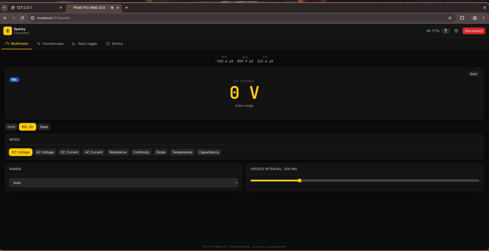
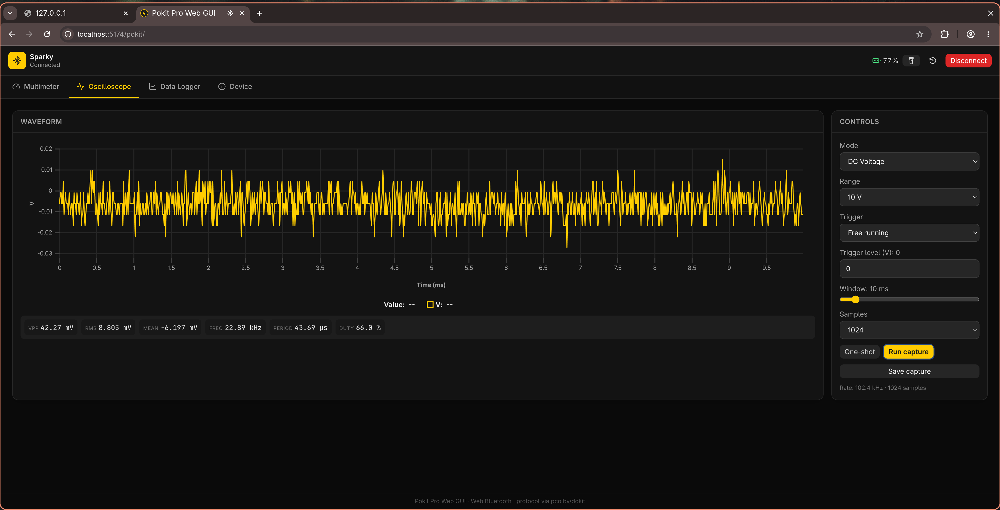
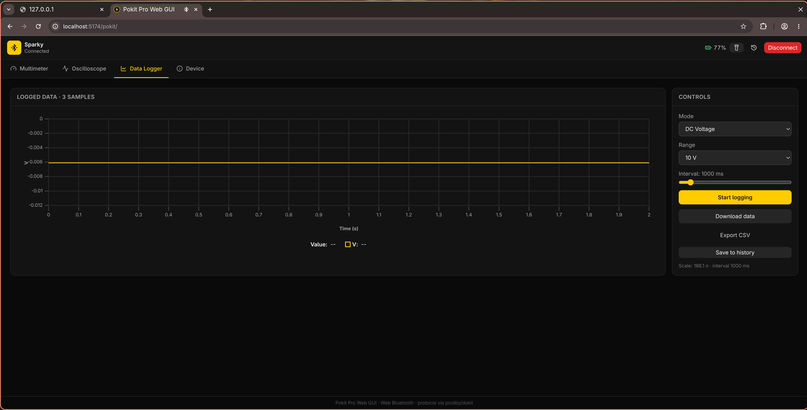
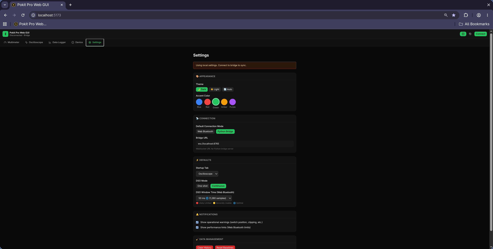

# Pokit Pro Web GUI

[](https://github.com/vailuc/pokit-pro-web-gui)
[]()
-- WARNING:  ti abandoned this repo as it is; it has been refactored as an addon into a upcoming IDE for all my tools. --

A browser-based multimeter, oscilloscope, and data logger for the [**Pokit Pro**](https://www.pokitmeter.com/).

Runs locally using either:

- **Web Bluetooth** — no installation beyond a Chromium browser
- **Python BLE Bridge** — native Bluetooth performance for extended oscilloscope use ([see Known Limitations](#known-limitations))

No cloud services. No account required. All communication remains local to your machine.

## Why This Exists

Most electronics work already happens beside a desktop, laptop, tablet, or phone.

This project explores whether portable test equipment can share a common, browser-based workflow for measurement, logging, visualization, and future bench-integration tools.

The initial target is the Pokit Pro — specifically my own Kickstarter-backed unit — but the architecture is being developed with additional instruments in mind: **one workbench UI, many instruments**. It is an independent, personal interoperability project, not affiliated with, authorised by, or endorsed by Pokit Innovations.

This started as a lightweight UX I built for my own Pokit Pro and shared immediately. It remains a work in progress.

## Privacy & Data

- **No cloud services.** No accounts. No telemetry.
- **Web Bluetooth mode** communicates directly between your browser and the device.
- **Bridge mode** uses a local Python process on `localhost`. No data leaves your machine.

## Features

- **Multimeter** — live DC/AC voltage, current, resistance, continuity, diode, temperature and capacitance with mode/range/interval controls, HOLD/REL/MinMaxAvg, and continuity beep.
- **Oscilloscope (DSO)** — triggered or free-running capture with a uPlot waveform, one-shot/continuous modes with adjustable window times, rolling buffer display, and computed metrics (Vpp, RMS, mean, frequency, period, duty cycle).
- **Data Logger** — interval logging over time with CSV export and auto-save.
- **Device** — firmware info, limits, live status & battery, flash LED, torch, rename.
- **Settings & Themes** — persistent settings with dark/light/auto theme support, accent colors, and DSO defaults.
- **IndexedDB History** — saved measurements with searchable history drawer.
- **Toast Feedback** — non-blocking status notifications.
- **Auto-reconnect** — automatically restores connection on page reload or transient BLE drop.
- **Dual Backend** — switch between Web Bluetooth and Python Bridge without changing your workflow.

## Project Status

**v0.2.0 — Early Alpha**

Implemented and actively usable (verified against my own Pokit Pro):

- Multimeter
- Oscilloscope
- Data Logger
- Device Management
- Settings & Themes

The project is under active development and protocol validation. Behaviour on other units or firmware revisions is unverified.

## Screenshots

| Multimeter | Oscilloscope |
|---|---|
|  |  |

| Data Logger | Settings |
|---|---|
|  |  |

<!--
Screenshots still to capture / fix:
- docs/screenshots/device.png         (Device Info tab — none currently exists)
- docs/screenshots/settings-light.png (light theme + an accent colour, to show theming)
-->

## Requirements

> ⚠️ **Web Bluetooth is Chromium-only.** Use Chrome, Edge, Brave, or Chromium. Firefox and Safari are **not** supported.

| Requirement | Version / Notes |
|-------------|-----------------|
| Browser | Chrome ≥ 89, Edge ≥ 89, Brave, Chromium |
| Context | Secure (`http://localhost` or HTTPS) |
| Host OS | Linux, macOS, Windows, Raspberry Pi OS (untested, see [Raspberry Pi notes](docs/raspberry-pi.md)) |
| Hardware | Pokit Pro multimeter (BLE 5.0) |
| Node.js | ≥ 18 (for build) |

## Getting Started

### Quick Start (Web Bluetooth — default)

```bash
git clone https://github.com/vailuc/pokit-pro-web-gui.git
cd pokit-pro-web-gui
npm install
npm run dev
```

Open the printed `http://localhost:5173`, click **Connect**, and choose your Pokit from the Chromium device chooser.

### Python Bridge Mode (better DSO performance)

For continuous oscilloscope monitoring without Web Bluetooth's ~150 ms notification gaps:

```bash
# One-command launcher (starts both bridge + frontend)
cd server
./launch-dev.sh
```

This starts:

- **BLE bridge** on `ws://localhost:8765` (Python, native Bluetooth via `bleak`)
- **Vite frontend** on `http://localhost:5173`

In the browser, while disconnected, click the **server icon** in the connection bar to switch to bridge mode, then press **Connect**. (The toggle is only shown when no device is connected. The bridge URL can be changed in Settings → Connection.)

See `server/README.md` for manual setup, requirements, and platform notes.

### Linux / Raspberry Pi notes

Web Bluetooth on Linux uses BlueZ and may require the experimental flag:

```
chrome://flags/#enable-experimental-web-platform-features
```

Ensure the Bluetooth service is running:

```bash
sudo systemctl enable --now bluetooth
```

On Raspberry Pi OS (Bookworm) use Chromium (not Firefox ESR). For kiosk/headless use:

```bash
chromium-browser --enable-features=WebBluetoothNewPermissionsBackend
```

> For a deeper dive on Pi kiosk deployment — what's tested, what's planned, and how the project started — see [`docs/raspberry-pi.md`](docs/raspberry-pi.md).

## Settings & Persistence

Settings use a layered store:

| Layer | Scope | Backend |
|-------|-------|---------|
| **localStorage** | Browser-only cache; source of truth in Web Bluetooth mode | Always active |
| **settings.json** | `~/.config/pokit-pro/settings.json` | Python bridge mode |
| **Bridge sync** | Live bidirectional reconciliation | When bridge connected |

In bridge mode, the app pulls on-disk settings on connect and reconciles them with local state. Changes are written back atomically (temp file → `fsync` → rename). If the bridge is unavailable, everything falls back to `localStorage` so the app stays fully functional.

**What you can configure:** theme (dark / light / auto), accent colour (blue / red / green / amber / purple), startup tab, connection mode & bridge URL, and per-tool defaults (DSO window/mode, meter auto-range, logger rate/duration).

## Known Limitations

### Oscilloscope (DSO)

The Pokit Pro **does not support true continuous streaming** in any mode (a firmware limitation, not a Web Bluetooth issue). The official Pokit app achieves "continuous" by rapidly re-triggering single-shot captures with native Bluetooth APIs.

**Web Bluetooth adds further constraints:**

- **Notification gaps** — 135–150 ms batching delays in Chromium's Web Bluetooth implementation
- **No connection control** — cannot set MTU or connection intervals (native apps can)
- **Firmware bug** — beyond ~2800 samples the device can return stale/repeated data (confirmed in the Pokit Pro 1.6.0 changelog: "Fix: DSO sending invalid number of samples in case of BLE timeout")

**Current handling:**

- Sample count is capped at 4096 (selector range 256–4096); larger captures will be revisited after more testing
- UI updates are throttled to `requestAnimationFrame` cadence
- Continuous mode re-triggers single-shot captures with adjustable window times (see the colour-coded picker in the DSO view)

The Python bridge sidesteps most of these by using native BLE — recommended for extended oscilloscope use.

### Multimeter

Not affected. Live readings work perfectly over Web Bluetooth (infrequent notifications, default ~100 ms).

### Data Logger

Untested at high sample rates. Likely fine for slow intervals (>1 s); may show similar issues at high frequency.

### Browser Support

- **No iOS / iPadOS / Safari support** — Web Bluetooth is not available on Apple platforms.
- **Browser permission prompts required** — Chromium will ask for Bluetooth access on first connect.
- **Host OS Bluetooth stack** — Linux requires BlueZ; Windows and macOS generally work out of the box.

## Scripts

| Script | Purpose |
|--------|---------|
| `npm run dev` | Start Vite dev server |
| `npm run build` | Type-check and build for production |
| `npm run preview` | Preview the production build |
| `npm test` | Run unit tests (Vitest) |
| `server/launch-dev.sh` | Start Python bridge + Vite together (dev stack) |

## Architecture

```
src/
  pokit/        Framework-agnostic protocol layer (no React)
    uuids.ts                Service/characteristic UUIDs
    types.ts                Enums, structs, Pokit Pro range tables
    codec.ts                Little-endian ByteReader/ByteWriter
    connection.ts           PokitConnection: Web Bluetooth requestDevice + GATT (IPokitConnection)
    websocketConnection.ts  WebSocketPokitConnection: Python bridge backend (IPokitConnection)
    abstractService.ts      Base class (read/write/notify)
    statusService.ts / multimeterService.ts / dsoService.ts / loggerService.ts
    device.ts               PokitDevice facade (backend-agnostic)
  store/          Zustand state
    deviceStore.ts          Connection, reconnect, status, LED/torch, backend switching
    settingsStore.ts        Layered settings (localStorage + bridge sync)
    historyStore.ts         IndexedDB saved measurements
    toastStore.ts           Toast notifications
  components/     UI primitives, ConnectBar, Readout, Waveform (uPlot), Toast,
                  HistoryDrawer, SwitchIndicator, ThemeProvider
  utils/
    dsoLimits.ts            Colour-coded DSO window-time guidance
  views/          MultimeterView, OscilloscopeView, LoggerView, DeviceInfoView, SettingsView
  App.tsx         Tabbed shell

server/           Python BLE bridge (bleak + WebSocket)
  pokit_server.py         Bridge server + settings persistence
  launch-dev.sh / run-server.sh / setup.sh / stop-dev.sh
```

The `pokit/` layer has **no React dependency** and is covered by unit tests in:

- `src/pokit/codec.test.ts`
- `src/lib/waveformMetrics.test.ts`
- `src/lib/format.test.ts`

## Protocol summary

| Service | UUID | Purpose |
|---------|------|---------|
| Pokit Status (Pro) | `57d3a771-…aec5` | device info, status, name, LED, torch |
| Multimeter | `e7481d2f-…dadc` | settings (write) + reading (notify) |
| DSO | `1569801e-…9de6` | settings + metadata + sample stream |
| Data Logger | `a5ff3566-…4121` | settings + metadata + sample stream |

All multi-byte values are little-endian; floats are 32-bit. See `src/pokit/` for full byte layouts.

## Roadmap

- [ ] Additional instrument support
- [ ] Session recording and replay
- [ ] Project-oriented measurement workflows
- [ ] Mobile-friendly responsive layouts
- [ ] Offline PWA support
- [ ] `lastModified`-based settings conflict resolution across browsers
- [ ] Validate larger DSO sample counts (>4096) and raise the cap if reliable

## Acknowledgements

- [**pcolby/dokit**](https://github.com/pcolby/dokit) — Qt/C++ Pokit library used as an architectural reference for protocol understanding. This project contains no Dokit source code; it is an independent TypeScript implementation.
- **Pokit Innovations** — for the Pokit Pro hardware (backed via Kickstarter).
- [**uPlot**](https://github.com/leeoniya/uPlot) — lightweight plotting library used for the oscilloscope.
- [**bleak**](https://github.com/hbldh/bleak) — cross-platform Python BLE library powering the bridge.

## Contributing

Contributions are welcome. By submitting a pull request, issue, or any other contribution to this repository, you agree to license your contribution under GPL-3.0 and grant the project maintainer the right to include it in commercial licensing.

This does not transfer copyright — you retain ownership of your work.

## License

Dual-licensed under GPL-3.0 (open source) and a commercial license — see [`LICENSING.md`](LICENSING.md). The full GPL-3.0 text is in [`LICENSE`](LICENSE).
